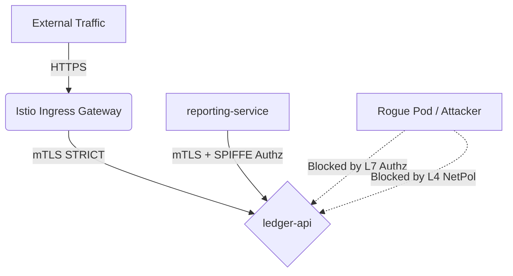

# Dodo Payments Security Assessment

This repository contains the complete solution for the Dodo Payments Security & DevOps Engineer Technical Assessment. 
The assessment addresses securing the `ledger-api` microservice from insecure defaults to a production-grade, hardened state, along with comprehensive vulnerability research.

## Assessment Overview

The project is structured into four main tasks:

1. **[Task 1: Workload Hardening](task1/)**
   - Locked down the `ledger-api` Pod Security Standards using Kyverno `restricted` policies.
   - Removed root privileges, added resource limits, and dropped all unnecessary Linux capabilities.
   - Decoupled secrets from Git by utilizing Kubernetes Secrets with base64 encoding (simulating a sealed-secret/external secret setup in a real environment).

2. **[Task 2: Secure Delivery & GitOps](task2/)**
   - Established a secure CI pipeline using GitHub Actions to test, build, and sign container images.
   - Enforced security gates using SAST (Semgrep), Dependency Scanning (Trivy), and Secret scanning (Gitleaks).
   - Adopted a GitOps strategy using ArgoCD to detect configuration drift and enforce self-healing across the cluster.

3. **[Task 3: Service Mesh & Zero-Trust](task3/)**
   - Installed the Istio Service Mesh to enforce a cryptographically-verified Zero-Trust Architecture.
   - Implemented STRICT mTLS (`PeerAuthentication`) and default-deny `AuthorizationPolicies`.
   - Created a defense-in-depth model utilizing both Layer 7 (Istio) and Layer 4 (Kubernetes NetworkPolicy) rules.

4. **[Task 4: Penetration Testing & Reconnaissance](task4/)**
   - Conducted an OSINT map of the `dodopayments.tech` external perimeter.
   - Executed a focused, authorized penetration test against the local `ledger-api` application.
   - Identified Critical Insecure Deserialization (RCE) and High Server-Side Request Forgery (SSRF) vulnerabilities, chaining them to illustrate realistic attack vectors that bypass standard controls.

## Environment Architecture

## Bonus Implementations Completed
* Kyverno/OPA Gatekeeper guardrails deployed and tested for drift resistance.
* Istio Gateway traffic routing with Canary rollout configuration (VirtualService + DestinationRule).
* PCI-DSS Cardholder Data Environment (CDE) segmentation analysis.
* Full finding chain and remediation mapping in the Task 4 Pentest Report.

## Getting Started
Each task directory (`task1/`, `task2/`, `task3/`, `task4/`) contains its own detailed `README.md` explaining the implementation rationale, architectural choices, and verification screenshots.
