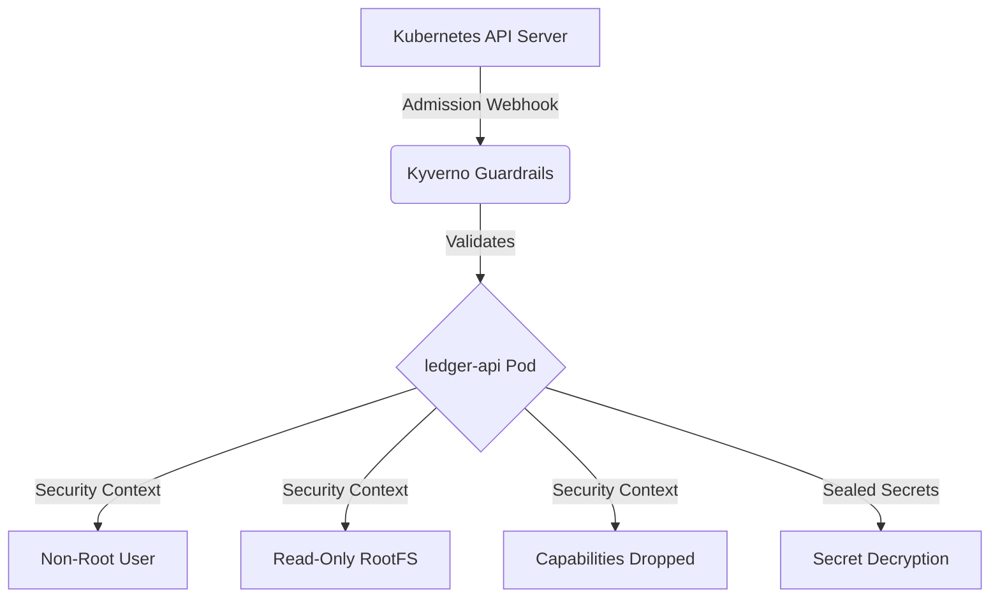
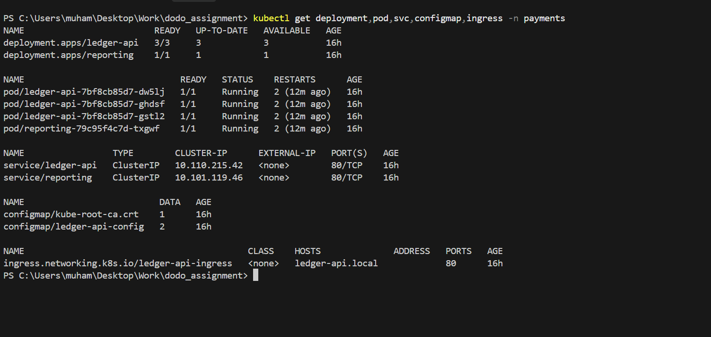
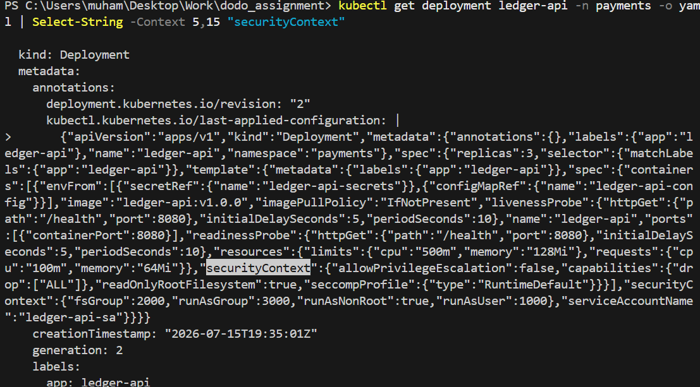
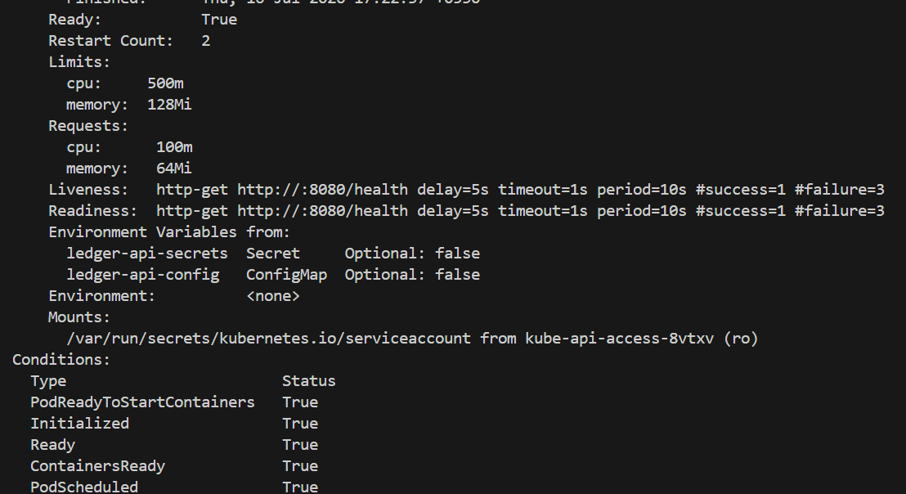
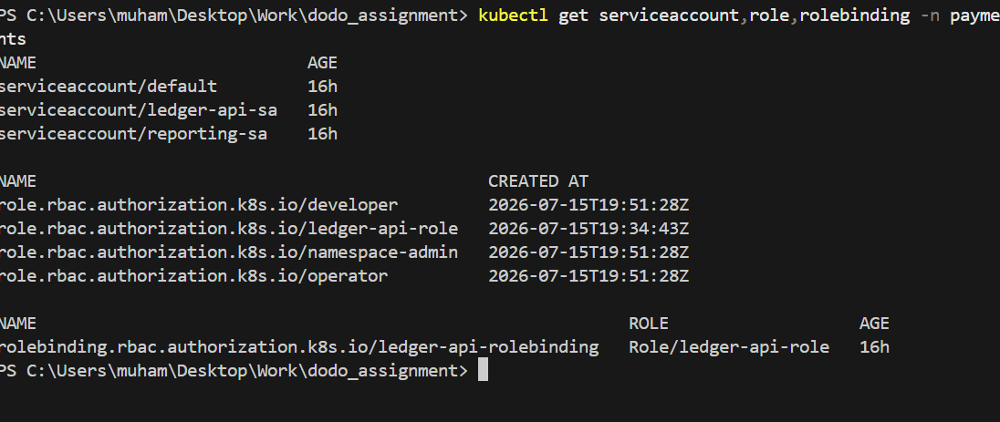
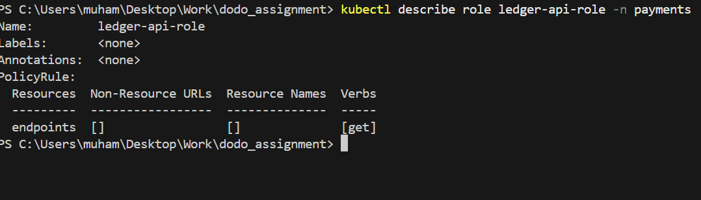
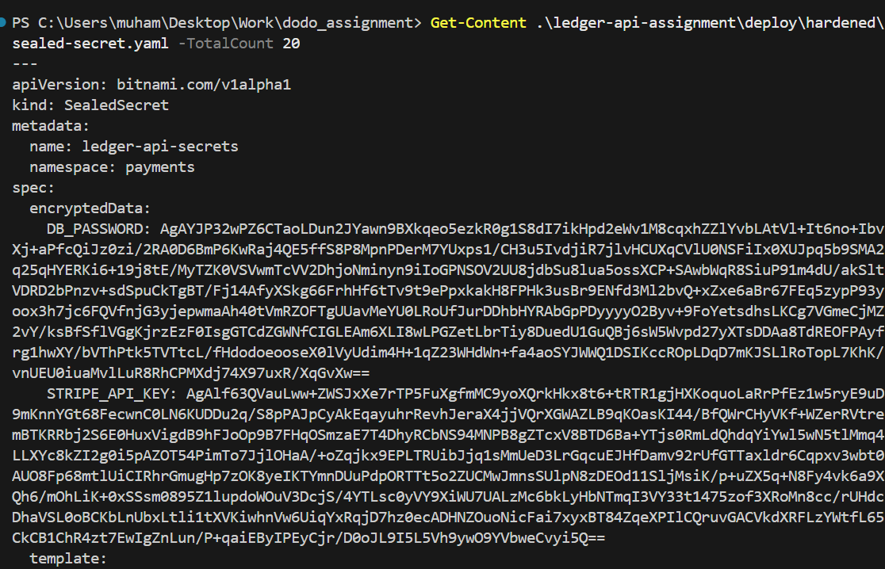
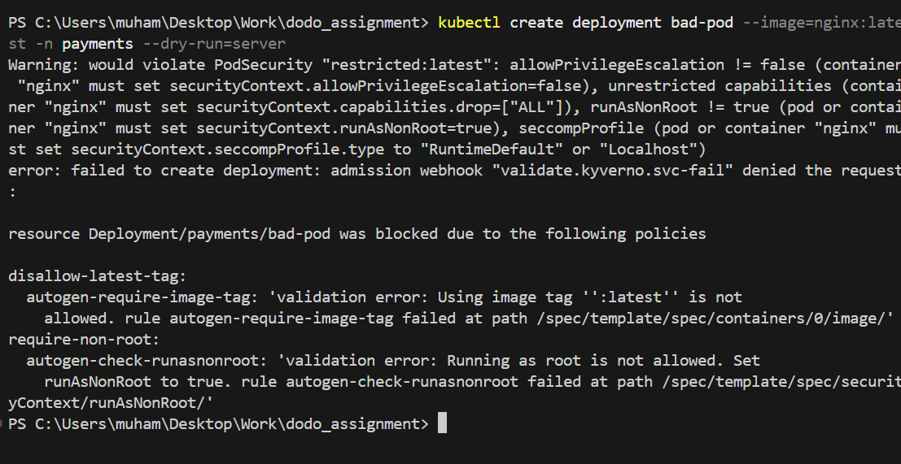
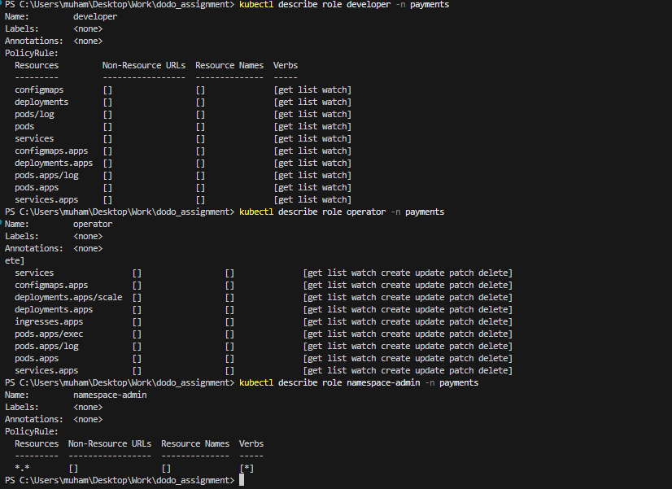

# Task 1: Deploy & Harden the Workload

## Overview
This document outlines the design decisions and evidence of execution for hardening the `ledger-api` microservice to meet production-grade and PCI DSS baseline requirements.

## Architecture

---

## Proof of Execution (Screenshots)

### 1. Workload Overview (Deployments, Services, ConfigMaps, Ingress)
*Demonstrates the deployment of `ledger-api` alongside the neighbour service, with all corresponding Services, ConfigMaps, and Ingress resources running in the `payments` namespace.*

### 2. Live Security Context (runAsNonRoot, Read-only FS, etc.)
*Proves the container is actively running with a restricted security context, including `runAsNonRoot: true`, a read-only root filesystem, dropped capabilities, and the `RuntimeDefault` seccomp profile.*

### 3. Resource Limits & Probes
*Shows the pod configuration with CPU/Memory Requests and Limits properly defined, as well as the active Liveness and Readiness probes to ensure health monitoring.*

### 4. RBAC & Service Accounts
*Demonstrates that the default ServiceAccount was dropped in favor of a dedicated, least-privilege ServiceAccount (`ledger-api-sa`), and shows the specific restricted `PolicyRule` assigned to it.*

### 5. Secret Management (GitOps Friendly)
*Proves that plaintext secrets were removed from Git and replaced with an encrypted Secret Management solution (Sealed Secrets).*

### 6. Admission Control Guardrails (Kyverno)
*Shows Kyverno admission webhooks actively intercepting and blocking insecure workloads (e.g., rejecting the `:latest` tag and root users).*

---

## Bonus Implementations

### 7. Persona-based RBAC
*Shows the implementation of least-privilege Role-Based Access Control for distinct human personas (`developer` and `operator`), ensuring developers have read-only access while operators can manage deployments.*

### 8. Pod Security Standards (Restricted)
*Demonstrates the enforcement of Kubernetes Pod Security Standards (Restricted profile) at the namespace level via active namespace labels.*

