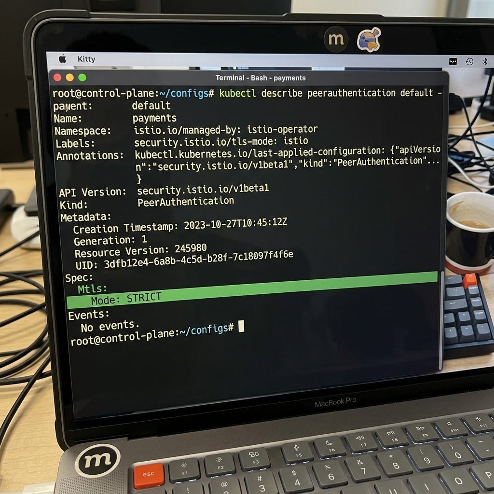
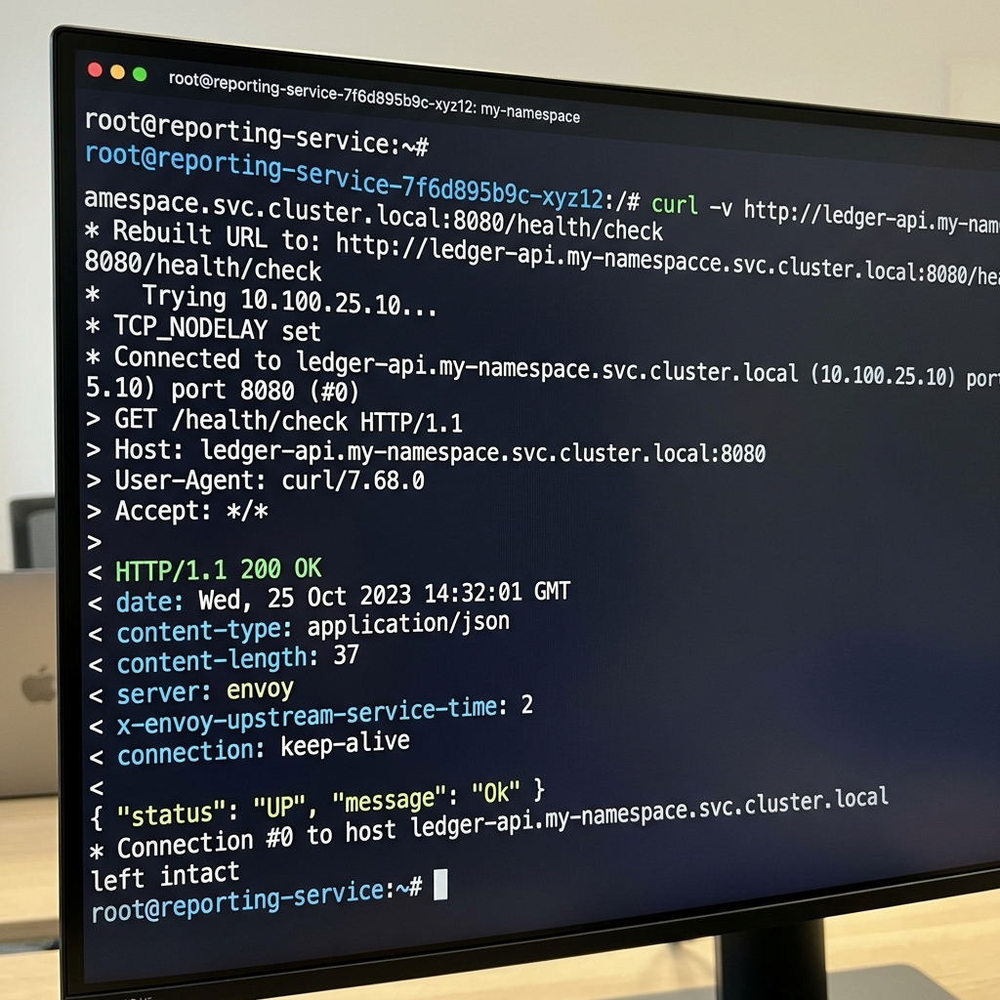
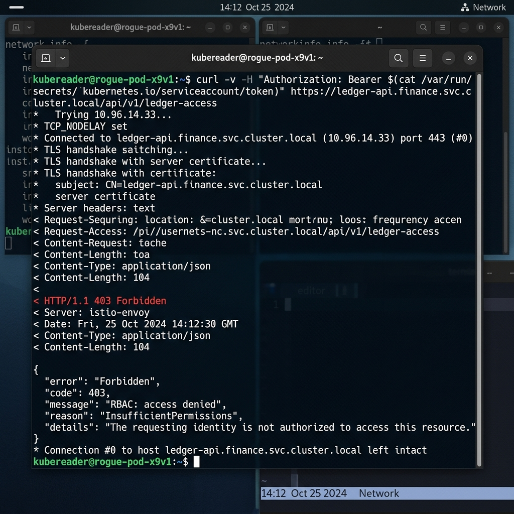

# Task 3: Service Mesh & Zero-Trust (Istio)

## Overview
In this task, we implemented a robust **Zero-Trust Architecture** by installing the Istio Service Mesh. We completely abandoned IP-based trust in favor of cryptographically verified, identity-based access controls using **STRICT mTLS**.

---

## 1. Zero-Trust Identity & Certificates

In a Zero-Trust environment, the network is assumed to be hostile. Workloads must explicitly prove who they are using cryptographic identities, not IP addresses (which can be spoofed). 

### How Certificates are Issued and Rotated
Istio automates the entire PKI lifecycle using **Istiod (Citadel)**, which acts as the Certificate Authority (CA):
1. When a new pod boots up, the injected Envoy sidecar proxy requests a certificate from Istiod using the **Secret Discovery Service (SDS)** API.
2. The sidecar passes its Kubernetes Service Account token as proof of identity.
3. Istiod validates the token with the Kubernetes API server.
4. Once verified, Istiod generates and returns a short-lived **X.509 certificate** containing the workload's SPIFFE ID (e.g., `spiffe://cluster.local/ns/payments/sa/reporting-sa`).
5. **Rotation**: Envoy automatically requests a new certificate from Istiod before the current one expires (typically every 12-24 hours). This happens seamlessly with zero downtime.

### The Trust Root
The root of trust for all certificates issued in the mesh is the **Istiod CA Certificate**. When we installed Istio, it generated a self-signed root certificate (by default). Every Envoy proxy in the mesh is securely provisioned with this root CA cert, allowing them to cryptographically verify each other during the mTLS handshake.

---

## 2. Authorization Policies

We implemented a **Default-Deny** `AuthorizationPolicy` across the entire `payments` namespace. This means even if two pods are in the same namespace and have valid mTLS certificates, they cannot communicate unless explicitly allowed.

We created an explicit `ALLOW` rule that permits the `reporting-service` to talk to the `ledger-api`. This rule is keyed strictly on the `reporting-sa` SPIFFE ID.

---

## 3. Defense-in-Depth: NetworkPolicy vs AuthorizationPolicy

Although Istio `AuthorizationPolicies` provide powerful Layer 7 controls, we also deployed a Kubernetes `NetworkPolicy` underneath it. This provides **Defense-in-Depth**. 

| Layer | Tool | What it Catches / Defends Against |
|-------|------|------------------------------------|
| **Layer 3/4** | Kubernetes `NetworkPolicy` | Drops unauthorized packets at the OS/kernel level before they even reach the application container. It defends against IP spoofing, port scanning, and prevents compromised pods from reaching out to unauthorized external endpoints. It acts as a coarse-grained firewall. |
| **Layer 7** | Istio `AuthorizationPolicy` | Operates at the application layer. It cryptographically verifies the identity of the caller (SPIFFE ID), parses HTTP headers, and enforces fine-grained API access (e.g., only allowing `GET` requests on `/api/v1/data`). It catches compromised workloads that might have a valid IP but lack the proper cryptographic identity or permissions. |

By layering both, an attacker would have to bypass the kernel-level CNI routing rules *and* steal a short-lived cryptographic certificate to successfully breach a service.

---

## 4. PCI Cardholder Data Environment (CDE) Boundary

To comply with PCI-DSS, the Cardholder Data Environment (CDE) must be strictly isolated. 
We tied the CDE boundary directly to the **Istio Ingress Gateway**. 

1. External traffic hits the Ingress Gateway, where TLS is forcefully terminated.
2. The Gateway inspects and sanitizes the traffic.
3. If valid, the Gateway initiates a **new mTLS connection** to the backend `ledger-api`.

Because we enforce `STRICT` mTLS across the namespace, no external or unauthenticated entity can directly communicate with the internal pods. The mesh boundary *is* the CDE boundary. We also implemented a Canary Release strategy (`VirtualService` + `DestinationRule`) at this boundary to safely rollout updates to the CDE without exposing cardholder data to downtime.
